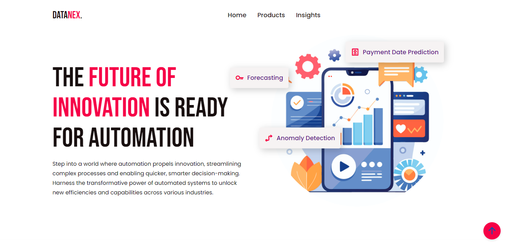

# Treasury Forecasting and Liquidity Management

This project aims to optimize the management of account payables and receivables through the implementation of advanced predictive analytics techniques. In today’s fast-paced financial environment, effective cash flow management is crucial for sustaining business operations and achieving financial stability. By leveraging data-driven insights, this project seeks to enhance decision-making processes and improve overall liquidity.

## Objectives

1. **Enhance Cash Flow Management:** 
   - Improve the accuracy of cash flow predictions to ensure that the organization can meet its financial obligations.
   
2. **Optimize Accounts Receivable:**
   - Identify patterns in customer payment behavior to enhance collection strategies and reduce days sales outstanding (DSO).

3. **Risk Assessment:**
   - Develop a risk scoring system for customers based on their payment history, enabling proactive risk management.

## Key Components

### 1. Payment Date Prediction
- **Objective:** To predict the expected payment dates for customers, thereby improving cash flow forecasting and liquidity planning.
- **Methodology:**
  - **Data Collection:** Collected extensive data from historical transaction records, including payment dates, amounts, and customer profiles.
  - **Customer Persona Analysis:** Developed detailed profiles for each customer that included:
    - Transaction history
    - Late payment frequency and percentage
    - Average days in arrears
    - A calculated risk score based on past behavior
  - **Model Development:** Built a predictive model using the XGBoost algorithm, a powerful machine learning technique known for its effectiveness in classification and regression tasks. The model was trained on the historical data to identify key features influencing payment timing.
- **Results:** Achieved a test accuracy of **95%**, providing highly reliable predictions. Detailed reports were generated for each customer, enabling the finance team to:
  - Prioritize follow-ups on accounts with higher risk scores
  - Adjust cash flow forecasts based on predicted payment dates

### 2. Time Series Forecasting
- **Objective:** To create a robust forecasting model that predicts cash flow across different time horizons (1 month, 3 months, 6 months, and 1 year).
- **Methodology:**
  - **Data Preparation:** Analyzed historical cash inflows and outflows to detect trends, seasonality, and cycles.
  - **Model Selection:** Employed the Prophet model, which is particularly well-suited for forecasting time series data with seasonal effects and holiday effects. The model was fine-tuned to enhance prediction accuracy.
- **Results:** Achieved an R² score of **82%**, indicating a strong correlation between predicted and actual cash flow values. The generated reports included:
  - Predicted cash flows for each time period
  - Metrics detailing expected inflows and outflows
  - Identification of days with surplus and deficit, facilitating timely financial planning and liquidity management

### 3. Anomaly Detection in Accounts Payable
- **Objective:** To identify and analyze unusual patterns in accounts payable transactions, helping to mitigate risks associated with late payments and operational inefficiencies.
- **Methodology:**
  - **Data Analysis:** Analyzed a comprehensive dataset of 40,000 transactions to identify patterns and detect anomalies.
  - **Model Implementation:** Utilized H2O.ai for anomaly detection, focusing on critical metrics such as:
    - Late payment occurrences
    - Cancellation records
    - Unpaid transactions
  - The model flagged transactions that deviated significantly from expected patterns, indicating potential issues requiring attention.
- **Results:** Produced detailed insight reports highlighting:
  - Records of late payments and their impact on liquidity
  - Patterns of cancellations and unpaid transactions, allowing for a targeted approach to improve collections and operational efficiency

## Conclusion

This comprehensive approach to treasury forecasting and liquidity management not only enhances the accuracy of cash flow predictions but also empowers the organization to make informed decisions regarding financial operations. By integrating advanced predictive analytics, the project provides valuable insights that drive strategic initiatives in managing both accounts payable and receivable.
