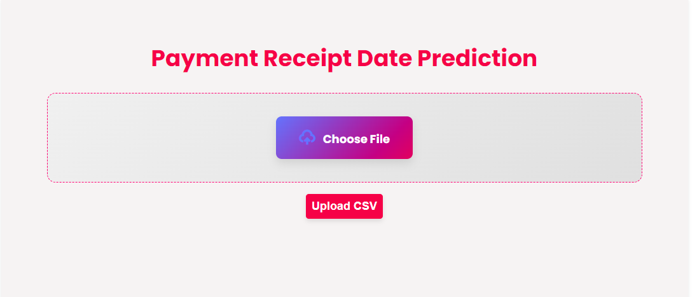

# Treasury Forecasting and Liquidity Management

This project aims to optimize the management of account payables and receivables through the implementation of advanced predictive analytics techniques. In today’s fast-paced financial environment, effective cash flow management is crucial for sustaining business operations and achieving financial stability. By leveraging data-driven insights, this project seeks to enhance decision-making processes and improve overall liquidity.

## Account Payables and Receivables

**Account Payables (AP)**:  
The money a company owes to its suppliers or creditors for goods and services received but not yet paid for. It represents the company's obligations to pay off short-term debts.

**Account Receivables (AR)**:  
The funds a company is owed by its customers for goods and services provided on credit. It reflects money that is expected to be received, contributing to the company’s cash flow.

In summary, AP is what a company owes, while AR is what it is owed.

## Objectives

## Project Objectives
1. **Enhance Cash Flow Management:**  
   - Improve the accuracy of cash flow predictions by utilizing advanced predictive analytics techniques. This will help the organization anticipate cash inflows and outflows, ensuring that it can meet its financial obligations in a timely manner. By creating more reliable forecasts, the organization can better manage its liquidity, allocate resources efficiently, and avoid potential cash shortages.

2. **Optimize Accounts Receivable:**  
   - Analyze historical data to identify patterns in customer payment behavior. By understanding these patterns, the organization can refine its collection strategies, targeting specific customers who may require additional follow-up or different engagement tactics. This optimization aims to reduce the Days Sales Outstanding (DSO), which is a key metric indicating how quickly a company collects payments from its customers. Improved collection rates will lead to enhanced cash flow and reduced risk of bad debts.

3. **Risk Assessment:**  
   - Develop a comprehensive risk scoring system for customers based on their payment history and other relevant factors. This scoring system will allow the organization to categorize customers by their likelihood of timely payment, enabling proactive risk management strategies. By identifying high-risk customers early, the organization can take preventive measures, such as adjusting credit terms or increasing communication, to mitigate potential losses and improve overall cash flow stability.

## Key Components
### 1. Payment Date Prediction

- **Objective:**  
  The primary objective of this project is to accurately predict the expected payment dates for customers. By leveraging advanced analytics, we aim to enhance cash flow forecasting and liquidity planning, ensuring that the organization can efficiently manage its financial resources and meet its obligations.

- **Methodology:**
  - **Data Collection:**  
    We gathered extensive data from historical transaction records, which included various attributes crucial for analysis, such as:
    - **Payment Dates:** The actual dates when payments were made, allowing us to analyze trends over time.
    - **Payment Amounts:** The amounts involved in each transaction, which helps in understanding customer payment capacities and patterns.
    - **Customer Profiles:** Detailed demographic and behavioral data for each customer, which provides context to their payment habits and preferences.
      
  - **Customer Persona Analysis:**

    We developed comprehensive profiles for each customer, which encompassed the following elements:
    - **Transaction History:** A complete record of all transactions with the customer, including purchase frequency and total spending over a specified period.
    - **Late Payment Frequency and Percentage:** Metrics indicating how often a customer has made late payments and the proportion of total transactions that were delayed. This helps identify consistent late payers.
    - **Average Days in Arrears:** The average number of days a customer is late in making payments, providing insights into their reliability and payment behavior.
    - **Risk Score Calculation:** A calculated risk score based on various factors derived from their payment history and behavior. This score categorizes customers into risk levels, enabling targeted strategies for risk management and cash flow optimization.
By employing these methodologies, we aim to create a robust framework for predicting payment behaviors, ultimately improving the organization's financial planning and liquidity management.

  - **Model Development:** Built a predictive model using the XGBoost algorithm, a powerful machine learning technique known for its effectiveness in classification and regression tasks. The model was trained on the historical data to identify key features influencing payment timing.
- **Results:** Achieved a test accuracy of **95%**, providing highly reliable predictions. Detailed reports were generated for each customer, enabling the finance team to:
  - Prioritize follow-ups on accounts with higher risk scores
  - Adjust cash flow forecasts based on predicted payment dates

### 2. Time Series Forecasting

- **Objective:**  
  The main goal of this segment is to develop a robust forecasting model that accurately predicts cash flow over varying time horizons—specifically for 1 month, 3 months, 6 months, and 1 year. By having reliable forecasts, the organization can better plan its financial strategies and ensure liquidity throughout different periods.

- **Methodology:**
  - **Data Preparation:**  
    The first step involved a thorough analysis of historical cash inflows and outflows. This process included:
    - **Trend Analysis:** Identifying long-term trends in cash flow data to understand general directions in revenue and expenses.
    - **Seasonality Detection:** Examining seasonal patterns that could affect cash flow, such as increased sales during holiday seasons or reduced expenses during off-peak periods.
    - **Cycle Analysis:** Recognizing business cycles that may influence cash flow, including economic factors and market conditions.
    - Data cleaning and normalization were also performed to ensure consistency and reliability of the input data.

  - **Model Selection:**  
    To create the forecasting model, we employed the **Prophet** model developed by Facebook. This model is particularly effective for:
    - Handling seasonal effects, which are critical for businesses that experience regular fluctuations in cash flow.
    - Accommodating holiday effects, allowing the model to adjust predictions based on significant events that impact sales.
    - The model was fine-tuned by:
      - Adjusting hyperparameters to optimize for specific business needs and cash flow characteristics.
      - Validating the model using historical data to ensure accuracy and reliability in predictions.

- **Results:**

  The forecasting model achieved an impressive R² score of **82%**, indicating a strong correlation between the predicted cash flow values and the actual values observed. This high level of accuracy is essential for effective financial planning. The generated reports provided valuable insights, including:
  - **Predicted Cash Flows for Each Time Period:** Detailed forecasts for 1 month, 3 months, 6 months, and 1 year, enabling strategic decision-making regarding investments and expenditures.
  - **Metrics Detailing Expected Inflows and Outflows:** Comprehensive breakdowns of anticipated revenues and costs, aiding in the assessment of potential liquidity positions.
  - **Identification of Days with Surplus and Deficit:** Highlighting specific dates where cash flow is expected to exceed or fall short of needs. This information is crucial for timely financial planning, allowing the organization to make informed decisions regarding cash reserves, borrowing needs, and investment opportunities.

Overall, the implementation of this time series forecasting model significantly enhances the organization's ability to manage its cash flow effectively, ensuring financial stability and supporting long-term growth strategies.

### 3. Anomaly Detection in Accounts Payable

- **Objective:**  
  The primary objective of this analysis is to identify and analyze unusual patterns in accounts payable transactions. By detecting anomalies, the organization can mitigate risks associated with late payments and operational inefficiencies, ultimately leading to improved financial management and vendor relationships.

- **Methodology:**
  - **Data Analysis:**

    We began by analyzing a comprehensive dataset consisting of **40,000 transactions** related to accounts payable. The analysis involved several key steps:
    - **Exploratory Data Analysis (EDA):** Conducted initial assessments to understand the distribution of payment amounts, frequencies, and timelines. This step helped identify normal operating patterns within the data.
    - **Feature Engineering:** Developed relevant features from the dataset, including:
      - Payment dates and amounts
      - Vendor details
      - Payment terms and conditions
      - Historical late payment trends for each vendor

  - **Model Implementation:**  
    To effectively detect anomalies, we utilized **H2O.ai**, a powerful machine learning platform, to implement our anomaly detection model. The model focused on several critical metrics:
    - **Late Payment Occurrences:** Tracking the frequency and patterns of late payments for each vendor to identify which suppliers are consistently problematic.
    - **Cancellation Records:** Analyzing the number and reasons for canceled payments, which could indicate underlying issues with vendor performance or transaction errors.
    - **Unpaid Transactions:** Monitoring instances of unpaid invoices to identify potential cash flow risks and operational bottlenecks.

    The model applied advanced algorithms, such as Isolation Forest and Autoencoders, to flag transactions that deviated significantly from expected patterns. These flagged transactions were categorized for further investigation, indicating potential issues requiring attention.

- **Results:**  
  The anomaly detection process produced detailed insight reports that highlighted several key findings:
  - **Records of Late Payments and Their Impact on Liquidity:** The reports included comprehensive statistics on late payment occurrences, illustrating how delays affect overall liquidity and cash flow management. This information is vital for making informed decisions about payment strategies and vendor negotiations.
  - **Patterns of Cancellations and Unpaid Transactions:** The analysis revealed specific trends and correlations, allowing the organization to adopt a targeted approach to improve collections. By addressing the root causes of cancellations and unpaid invoices, operational efficiency can be enhanced, and relationships with vendors can be strengthened.
  - **Recommendations for Improvement:** Based on the findings, the reports provided actionable recommendations to minimize late payments and streamline the accounts payable process. These included improving communication with vendors, renegotiating payment terms, and implementing stricter approval processes for payments.

Overall, the anomaly detection initiative equips the organization with valuable insights and tools to enhance its accounts payable operations, reducing risks and improving overall financial health.

## Conclusion

This comprehensive approach to treasury forecasting and liquidity management not only enhances the accuracy of cash flow predictions but also empowers the organization to make informed decisions regarding financial operations. By integrating advanced predictive analytics, the project provides valuable insights that drive strategic initiatives in managing both accounts payable and receivable.
